# ClawDemo — 实验室设备管理系统

基于 Spring Boot 4.1 + Vue 3 的全栈实验室设备管理平台。

## 功能

- **设备管理**：管理员可增删改设备，支持分类（仪器/耗材/软件/其他）、关键字搜索
- **借还审批**：用户提交借用申请 → 管理员审批 → 用户归还
- **用户系统**：开放注册、JWT 登录、角色权限（普通用户 / 管理员）
- **前端**：响应式 Material Design 3 风格，支持明暗主题

## 图片展示

**用户模式**

| 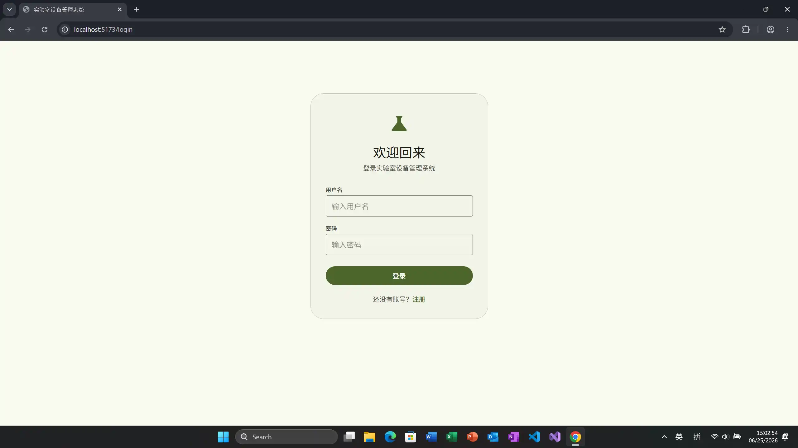 | 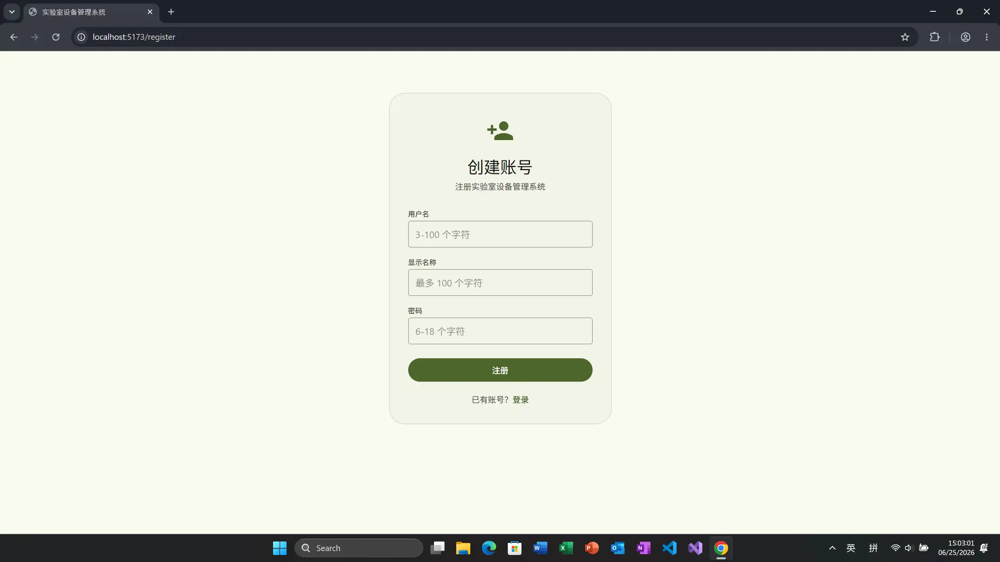 |
| :---: | :---: |
| 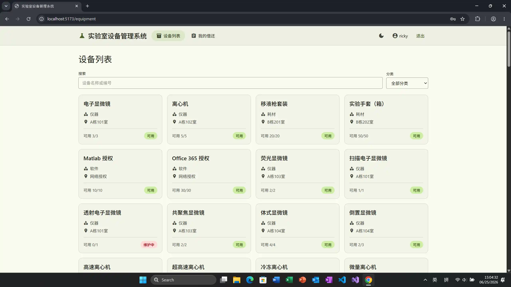 | 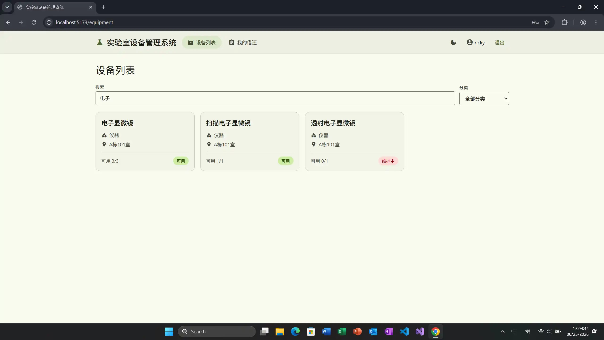 |
| 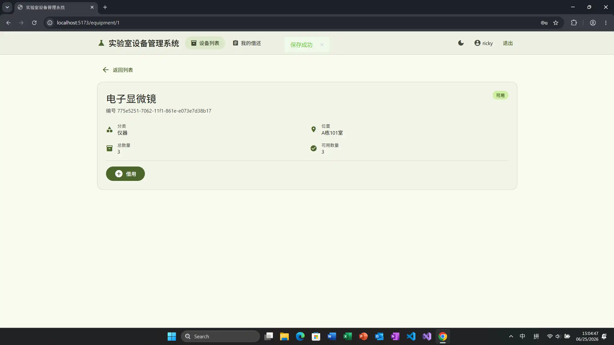 | 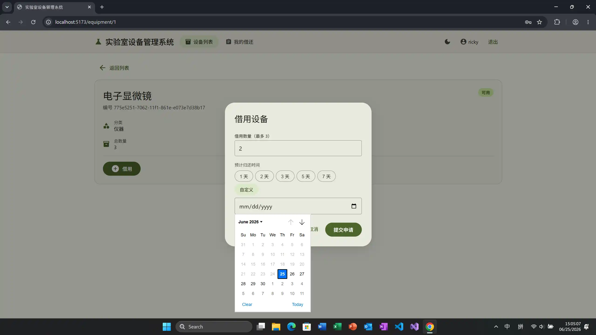 |
| 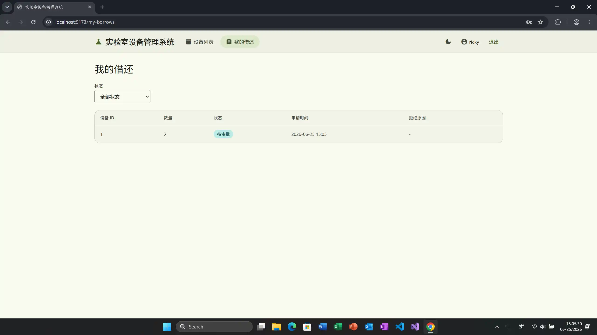 |  |

---

**管理员模式**

| 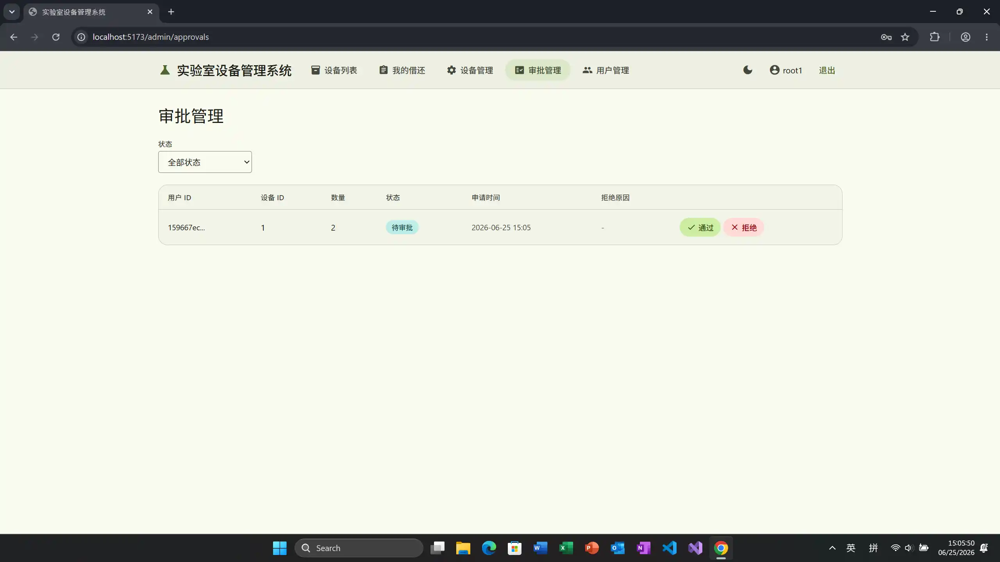 | 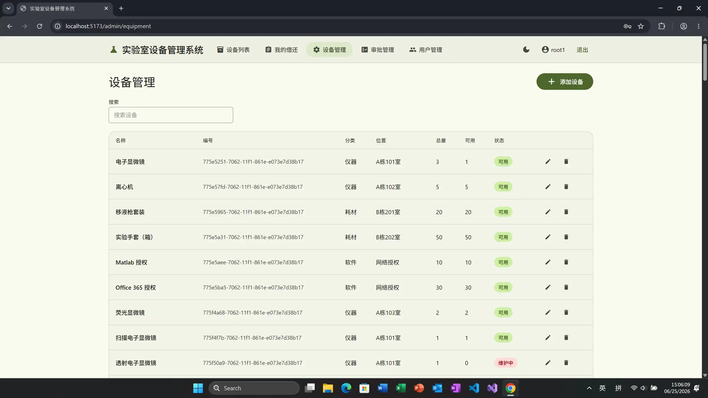 |
| :---: | :---: |
| 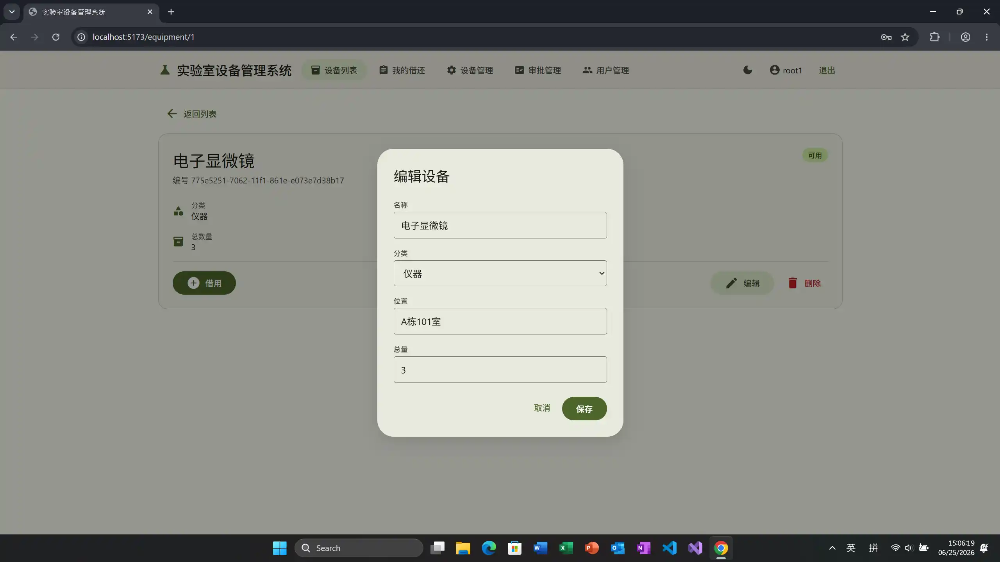 | 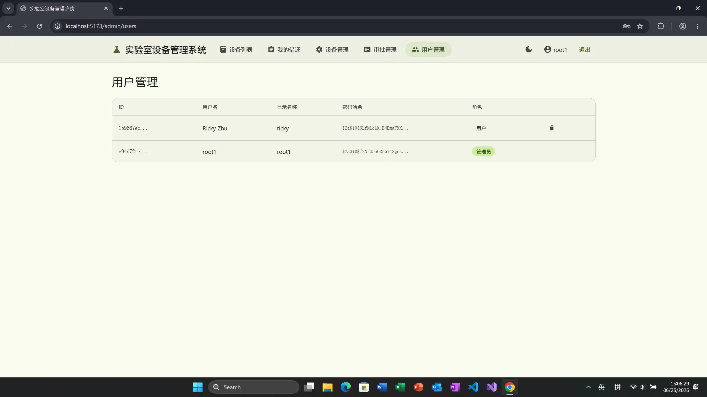 |
| 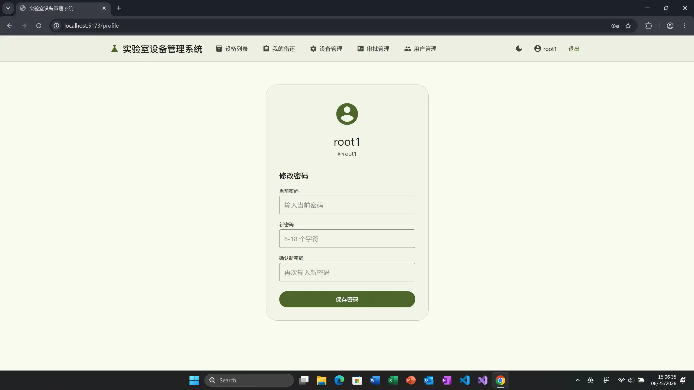 |  |


## 技术栈

| 层级 | 技术 |
|------|------|
| 后端 | Java 21, Spring Boot 4.1.0, Spring Security, Spring JDBC (JdbcTemplate), JWT |
| 前端 | Vue 3, Vite, Vue Router, Pinia, Axios |
| 数据库 | MySQL 8 |
| 构建 | Maven (wrapper 3.9.16) |

## 快速启动

### 前置条件

- JDK 21
- MySQL 8+
- Node.js 18+

### 数据库

```powershell
mysql -u root -p -e "CREATE DATABASE IF NOT EXISTS clawdemo DEFAULT CHARACTER SET utf8mb4;"
```

表结构和种子数据在首次启动时自动初始化，无需手动执行 SQL。

### 建表语句

```sql
CREATE TABLE IF NOT EXISTS `user` (
    `id` VARCHAR(36) PRIMARY KEY,
    `username` VARCHAR(100) NOT NULL UNIQUE,
    `password` VARCHAR(255) NOT NULL,
    `display_name` VARCHAR(100) NOT NULL,
    `role` VARCHAR(20) NOT NULL DEFAULT 'ROLE_USER',
    `created_at` DATETIME NOT NULL DEFAULT CURRENT_TIMESTAMP,
    `updated_at` DATETIME NOT NULL DEFAULT CURRENT_TIMESTAMP ON UPDATE CURRENT_TIMESTAMP
) ENGINE=InnoDB DEFAULT CHARSET=utf8mb4;

CREATE TABLE IF NOT EXISTS `equipment` (
    `id` BIGINT AUTO_INCREMENT PRIMARY KEY,
    `name` VARCHAR(200) NOT NULL,
    `code` VARCHAR(50) NOT NULL UNIQUE,
    `category` VARCHAR(30) NOT NULL COMMENT 'INSTRUMENT/CONSUMABLE/SOFTWARE/OTHER',
    `location` VARCHAR(200) DEFAULT '',
    `total_quantity` INT NOT NULL DEFAULT 0,
    `available_quantity` INT NOT NULL DEFAULT 0,
    `status` VARCHAR(30) NOT NULL DEFAULT 'AVAILABLE' COMMENT 'AVAILABLE/MAINTENANCE/RETIRED',
    `created_at` DATETIME NOT NULL DEFAULT CURRENT_TIMESTAMP,
    `updated_at` DATETIME NOT NULL DEFAULT CURRENT_TIMESTAMP ON UPDATE CURRENT_TIMESTAMP
) ENGINE=InnoDB DEFAULT CHARSET=utf8mb4;

CREATE TABLE IF NOT EXISTS `borrow_record` (
    `id` BIGINT AUTO_INCREMENT PRIMARY KEY,
    `user_id` VARCHAR(36) NOT NULL,
    `equipment_id` BIGINT NOT NULL,
    `quantity` INT NOT NULL DEFAULT 1,
    `start_time` DATETIME DEFAULT NULL,
    `end_time` DATETIME DEFAULT NULL,
    `status` VARCHAR(30) NOT NULL DEFAULT 'PENDING' COMMENT 'PENDING/APPROVED/REJECTED/RETURNED',
    `reject_reason` VARCHAR(500) DEFAULT '',
    `created_at` DATETIME NOT NULL DEFAULT CURRENT_TIMESTAMP,
    `updated_at` DATETIME NOT NULL DEFAULT CURRENT_TIMESTAMP ON UPDATE CURRENT_TIMESTAMP,
    FOREIGN KEY (`user_id`) REFERENCES `user`(`id`),
    FOREIGN KEY (`equipment_id`) REFERENCES `equipment`(`id`)
) ENGINE=InnoDB DEFAULT CHARSET=utf8mb4;
```

### 实体-关系图

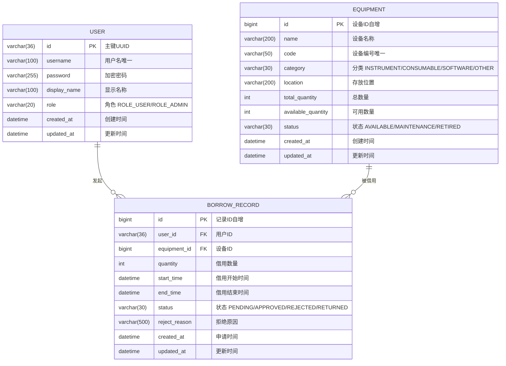

### 后端

```powershell
# 如果 MySQL 密码不是 root，先编辑 src/main/resources/application.properties
# spring.datasource.password=你的密码

./mvnw spring-boot:run
```

### 前端

```powershell
cd frontend
npm install
npm run dev
```

## 项目结构

```
src/main/java/io/github/darrindeyoung791/clawdemo/
├── config/          # Spring Security、CORS 等配置
├── controller/      # REST 控制器
├── dao/             # JdbcTemplate 数据访问层（手写 SQL）
├── entity/          # 数据库实体 POJO
├── service/         # 业务逻辑
└── util/            # JWT 工具类
frontend/            # Vue 3 前端
css/                 # MD3 配色主题
```

## API 概览

| 方法 | 路径 | 说明 | 权限 |
|------|------|------|------|
| POST | `/api/auth/register` | 用户注册 | 开放 |
| POST | `/api/auth/login` | 用户登录 | 开放 |
| GET | `/api/equipment` | 设备列表（含搜索） | 登录 |
| GET | `/api/equipment/{id}` | 设备详情 | 登录 |
| POST | `/api/equipment` | 新增设备 | 管理员 |
| PUT | `/api/equipment/{id}` | 编辑设备 | 管理员 |
| DELETE | `/api/equipment/{id}` | 删除设备 | 管理员 |
| POST | `/api/borrows` | 提交借用申请 | 登录 |
| GET | `/api/borrows` | 借还记录列表 | 登录 |
| GET | `/api/borrows/admin` | 全部记录（管理员） | 管理员 |
| PUT | `/api/borrows/{id}/approve` | 审批通过 | 管理员 |
| PUT | `/api/borrows/{id}/reject` | 审批拒绝 | 管理员 |
| PUT | `/api/borrows/{id}/return` | 归还设备 | 登录 |
